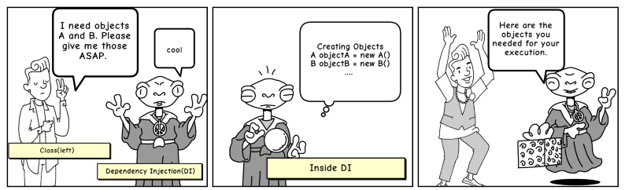
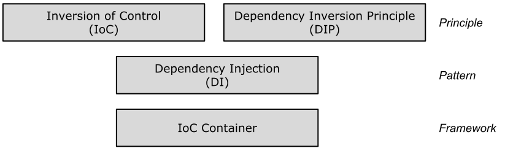

# Überblick

#### Definition

Aus "Wikipedia", der freien Enzyklopädie:

In der Softwareentwicklung versteht man unter *Dependency Injection* (kurz auch ***DI***) eine Technik,
welche Abhängigkeiten eines Objekts zur Laufzeit verwaltet.
Benötigt ein Objekt beispielsweise bei seiner Initialisierung ein anderes Objekt, 
ist diese Abhängigkeit an einem zentralen Ort hinterlegt. Die Abhängigkeit wird also nicht vom zu
initialisierenden Objekt selbst aufgelöst.

#### Ein kurzer Überblick

Die *Dependency Injection* ist eine Programmiertechnik, die eine Klasse von ihren Abhängigkeiten unabhängig macht.
Dies wird erreicht, indem die Verwendung eines Objekts von seiner Erstellung entkoppelt wird.
Auf diese Weise lassen sich Sie die Prinzipien der *Dependency Injection* und das *Single Responsibility Prinzip*
von **SOLID** befolgen.

Die Auflösung einer solchen Abgängigkeit bezeichnet man auch als "Injektion" (*Injection*),
das in diesem Zusammenhang zu erzeugende Objekt (auch als "Service" bezeichnet),
wird in ein Empfängerobjekt (auch als "Client" bezeichnet) *injiziert*.

Wenn eine Klasse A ein oder mehrere Funktionen einer Klasse B verwendet, dann sagt man,
dass Klasse A eine Abhängigkeit zu Klasse B aufweist.

*Alternative Formulierung*:
Bevor wir in C++ (gerne auch Java oder C#) Methoden anderer Klassen verwenden können,
müssen wir zuerst ein Objekt dieser Klasse erstellen, das heißt
Klasse `A` muss eine Instanz der Klasse `B` erstellen.

*Sprich*:
Das Übertragen der Aufgabe des Erstellens eines Objekts an eine andere *Instanz* als auch
das Eruieren dieser *Abhängigkeit* wird als **Dependency Injection** bezeichnet.

Abbildung 1: **Dependency Injection** bildlich dargestellt.

#### Motivation für den Einsatz von DI

Was spricht für den Einsatz von *Dependency Injection*?

Nehmen wir an, wir haben eine Fahrzeugklasse `Car`, die verschiedene Objekte wie Räder, Motor usw. enthält.

Prinzipiell ist die Fahrzeugklasse für die Erstellung aller von ihr abhängigen Objekte verantwortlich.
Was ist nun, wenn wir uns entscheiden, *Bridgestone*-Räder in Zukunft wegzulassen und an deren Stelle *Michelin* Räder verwenden möchten?

Wir müssen die Klasse `Car` mit einer neuen Abhängigkeit zu *Michelin* Rädern neu erstellen.
Würden wir auf *Dependency Injection* zurückgreifen, könnten wir die Räder jedoch zur Laufzeit ändern,
da Abhängigkeiten zur Laufzeit und nicht zur Übersetzungszeit injizierbar sind.

Sie können sich DI als den Mittelsmann in unserem Code vorstellen, der die gesamte Arbeit erledigt, um das bevorzugte Radobjekt zu erstellen und es der Fahrzeugklasse zur Verfügung zu stellen.

Auf diese Weise schaffen wir es, eine Fahrzeugklasse `Car` unabhängig von der Erstellung von Objekten wie Räder, Batterien usw. zu definieren!

#### Die Details im Überblick

Die Begriffe *Inversion of Control* (*IoC*), *Dependency Inversion Principle* (*DIP*), *Dependency Injection* (*DI*) 
und *IoC*-Container sind möglicherweise bekannt. Aber ist Ihnen klar, was jeder Begriff bedeutet?

Abbildung 2: Buzzwords im "Inversion of Control" Umfeld.

Wie in Abbildung 2 dargestellt, sind *IoC* und *DIP* allgemeine Entwurfsprinzipien, 
die beim Entwerfen von Klassen verwendet werden sollten. Da es sich um Entwurfsprinzipien handelt,
empfehlen sie bestimmte "Best Practices", helfen jedoch nicht mit spezifischen Implementierungsdetails.
*Dependency Injection* (*DI*) ist ein Software Entwurfsmuster und der *IoC*-Container wird durch ein Framework bereitgestellt.

###### Inversion of Control

IoC ist ein Entwurfsprinzip, das die Umkehrung (Inversion) unterschiedlicher Arten von "Kontrolle"
im objektorientierten Entwurf vorsieht, um eine lose Kopplung zwischen verschiendenen Klassen zu erreichen

Mit "Kontrolle" sind alle Verantwortlichkeiten gemeint, die eine Klasse hat,
wie z. B. die Kontrolle über den Ablauf einer Anwendung (Kontrollfluss)
oder die Kontrolle über die Erstellung und Verknüpfung (Bindung) abhängiger Objekte.

###### Dependency Inversion Principle

Das *Dependency Inversion Principle* sagt aus, dass High-Level-Module nicht von Low-Level-Modulen abhängen sollten.
Beide Ebenen (Klassen, Module) sollten mittels Schnittstellen abstrahiert werden.

Schnittstellen sollten nicht von Details, sondern die Details sollten von den Schnittstellen abhängen.

Das *Dependency Inversion Principle* wurde von Robert Martin (a.k.a. "Onkel Bob") erfunden.
Er ist einer der Begründer der **SOLID**-Prinzipien.

###### Dependency Injection

*Dependency Injection* (*DI*) ist ein Entwurfsmuster, das das *IoC*-Prinzip implementiert,
um die Erstellung abhängiger Objekte zu invertieren.

###### IoC Container

Ein *IoC*-Container ist ein Framework zur automatisierten Verwaltung der *Dependency Injections* 
in einer Anwendung, so dass der Programmierer hierfür nicht mehr Zeit und Aufwand spendieren muss.

## Literaturhinweise

*Hinweise*:

Viele Beispiele dieses Repositories stammen aus

[Hypodermic IoC Containers](https://www.tutorialsteacher.com/ioc/introduction)

---

[Zurück](../Readme.md)

---
