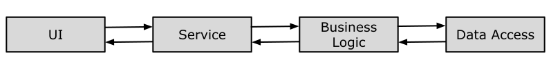
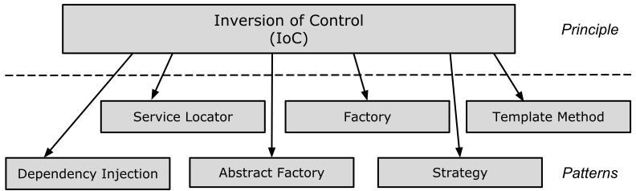

# Grundlagen

#### Inversion of Control

*Inversion of Control* (*IoC*) ist ein Entwurfsprinzip.
Wie der Name schon sagt, wird es eingesetzt, um unterschiedliche Arten der Kontrolle
im objektorientierten Design zu invertieren, um damit eine lose Kopplung zu erreichen.

###### Beispiel: Kontrolle über die Erstellung abhängiger Objekte

Das *Inversion of Control* Prinzip kann angewendet werden,
wenn wir Objekte einer abhängigen Klasse erstellen.
Lassen Sie uns zunächst an einem Beispiel verstehen, was wir hier unter Abhängigkeit verstehen:

```cpp
class B;

class A
{
private:
    B* m_b;

public:
    A()
    {
        m_b = new B();
    }

    void Task1() {
        // do something here ...
        m_b->someMethod();
        // do something here ...
    }
};

class B {
public:
    B() = default;

    void someMethod() {
        //doing something..
    }
};
```

Im obigen Beispiel ruft Klasse `A` `b.SomeMethod()` auf, um den Aufruf der Methode `Task1` auszuführen. 
Klasse`A` kann ihre Aufgabe nicht ohne Klasse `B` ausführen. Man kann also sagen,
dass "Klasse A von Klasse B abhängig ist" oder "Klasse B stelle eine Abhängigkeit von Klasse A dar".

Natürlich müssen beim objektorientierten Entwurf Klassen miteinander interagieren,
um eine Funktionalität einer Anwendung auszuführen, wie im obigen Beispiel - Klassen `A` und `B`.
Klasse `A` erstellt und verwaltet die Lebensdauer eines Objekts der Klasse `B`.
Anders fomuliert: Klasse `A` steuert die Erstellung und Lebensdauer von Objekten der abhängigen Klasse.

Das *Inversion of Control*-Prinzip schlägt vor, die Steuerung umzukehren.
Dies bedeutet, die Kontrolle an eine andere Klasse zu delegieren.
Mit anderen Worten, invertiere die Abhängigkeit des Erstellens von Objekten bestimmter Klassen von Klasse A in eine andere Klasse,
wie nachstehend gezeigt:

```cpp
class A
{
private:
    B* m_b;

public:
    A()
    {
        m_b = Factory::GetObjectOfB();
    }

    void Task1() {
        // do something here ...
        m_b->someMethod();
        // do something here ...
    }
};

class Factory
{
public:
    static B* GetObjectOfB()
    {
        return new B();
    }
}; 
```

Wie Sie oben sehen können, verwendet Klasse `A` die `Factory`-Klasse, um ein Objekt der Klasse `B` zu erzeugen.
Daher haben wir die Abhängigkeit der Objekterstellung von Klasse `A` in Klasse `Factory` invertiert.
Klasse `A` erstellt kein Objekt der Klasse `B` mehr, sondern verwendet die `Factory`-Klasse,
um Objekte der Klasse `B` zu generieren.

###### Ein anwendungsnaheres Beispiel

In einem objektorientierten Design sollten Klassen "lose gekoppelt" entworfen werden.
"Lose gekoppelt" bedeutet, dass Änderungen in einer Klasse nicht andere Klassen zu Änderungen zwingen sollten!
Die gesamte Anwendung sollte einfach erweiterbar sein.
Lassen Sie uns dies anhand einer typischen *n*-Tier-Architektur betrachten, wie in der folgenden Abbildung dargestellt:



Abbildung 1: *n*-Tier-Software-Architektur.

In einer typischen *n*-Tier-Architektur verwendet die Benutzeroberfläche eine `Service`-Ebene,
um Daten abzurufen oder zu speichern. Die `Service`-Schicht verwendet die `BusinessLogic`-Klasse,
um Geschäftsregeln auf die Daten anzuwenden. Die `BusinessLogic`-Klasse hängt von der `DataAccess`-Klasse ab,
die die Daten abruft oder in der zugrunde liegenden Datenbank speichert.
Dies ist ein einfaches *n*-Tier-Architekturdesign.
Konzentrieren wir uns auf die `BusinessLogic`- und `DataAccess`-Klassen, um *IoC* zu verstehen

Das folgende Beispiel zeigt exemplarische `BusinessLogic`- und `DataAccess`-Klassen für einen Kunden:

```cpp
class CustomerBusinessLogic
{
private:
    DataAccess* m_dataAccess;

public:
    CustomerBusinessLogic()
    {
        m_dataAccess = new DataAccess();
    }

    std::string GetCustomerName(int id)
    {
        return m_dataAccess->GetCustomerName(id);
    }
};

class DataAccess
{
public:
    DataAccess() = default;

    std::string GetCustomerName(int id) {
        return "John Miller"; // get from the database in real application
    }
};
```

Wie wir im obigen Beispiel sehen können, hängt die `CustomerBusinessLogic`-Klasse von der `DataAccess`-Klasse ab.
Es wird ein Objekt der `DataAccess-Klasse` erstellt, um die Kundendaten abzurufen.

Welche - teils gravierenden - Nachteile weißt die Implementierung der beiden Klassen
`CustomerBusinessLogic` und `DataAccess` auf?

Im obigen Beispiel sind `CustomerBusinessLogic` und `DataAccess` "eng gekoppelte" Klassen,
da die `CustomerBusinessLogic`-Klasse die Referenz (Pointer oder vergleichbares) der konkreten `DataAccess`-Klasse enthält.
Außerdem wird ein Objekt der `DataAccess`-Klasse erstellt,
die `CustomerBusinessLogic`-Klasse ist somit für die Lebensdauer dieses Objekts mit zuständig.

Das heißt:

  1. `CustomerBusinessLogic`- und `DataAccess`-Klassen sind eng gekoppelte Klassen.
    Änderungen in der `DataAccess`-Klasse ziehen Änderungen in der `CustomerBusinessLogic`-Klasse nach sich.
    Wenn wir beispielsweise eine Methode in der `DataAccess`-Klasse hinzufügen, entfernen oder umbenennen,
    müssen wir die `CustomerBusinessLogic`-Klasse entsprechend ändern bzw. anpassen.
  2. Wenn die Kundendaten von verschiedenen Datenbanken oder Web-Services zur Verfügung gestellt werden,
    sind mehrere `CustomerBusinessLogic`-Klasse erforderlich.
  3. Da die `CustomerBusinessLogic`-Klasse ein Objekt der konkreten `DataAccess`-Klasse erstellt,
    kann diese nicht unabhängig getestet werden (Test Driven Development).
    Die `DataAccess`-Klasse kann nicht durch eine *Mock*-Klasse ausgetauscht werden.


Um all die oben genannten Probleme zu lösen und ein lose gekoppeltes Software-Design zu erhalten,
wenden wir das IoC-Prinzip an. Nebenbei bemerkt: Eine Reihe von Software-Entwurfsmustern 
wenden dieser Prinzip an:



Abbildung 1: Software-Entwurfsmuster, die das *Inversion of Control* anwenden.

Aus Abbildung 1 wählen wir das Factory Entwurfsmuster aus, um die beiden Klassen `CustomerBusinessLogic` und `DataAccess`
einem Redesign zu unterwerfen:

```cpp
class DataAccessFactory
{
public:
    static DataAccess* GetDataAccessObj()
    {
        return new DataAccess();
    }
};

class CustomerBusinessLogic
{
private:
    DataAccess* m_dataAccess;

public:
    CustomerBusinessLogic()
    {
        m_dataAccess = new DataAccess();
    }

    std::string GetCustomerName(int id)
    {
        DataAccess* dataAccess = DataAccessFactory::GetDataAccessObj();
        return dataAccess->GetCustomerName(id);
    }
};
```

Wie Sie sehen, verwendet die `CustomerBusinessLogic`-Klasse die `DataAccessFactory::GetDataAccessObj`-Methode,
um ein Objekt der `DataAccess`-Klasse abzurufen, anstatt dieses mit `new` zu erzeugen.
Aus diese Weise haben wir die Kontrolle zum Erstellen eines Objekts einer abhängigen Klasse
von der `CustomerBusinessLogic`-Klasse in die `DataAccessFactory`-Klasse invertiert.

Dies ist eine einfache Implementierung von *Inversion of Control*
und der erste Schritt zur Erreichung eines vollständig lose gekoppelten Designs.

---

[Zurück](../Readme.md)

---
