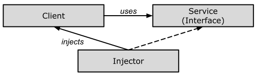
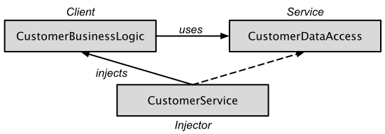

# Grundlagen

#### Dependency Injection

Im letzten Abschnitt sind wir auf *Abstraktion* eingegangen, um Klassen lose zu koppeln.
In diesem Abschnitt werden wir *Dependency Injection* und das Strategie-Entwurfsmuster zusammen implementieren,
um jegliche Abhängigkeit in der Erstellung eines abhängigen Objekts vollständig aus der Klasse zu entfernen.
Das Ziel ist es also, die betrachteten Klassen vollständig lose zu koppeln.

*Dependency Injection* (DI) ist ein Entwurfsmuster, das zur Implementierung von IoC verwendet wird.
Es ermöglicht die Erstellung abhängiger Objekte außerhalb einer Klasse und stellt den Zugang 
dieser Objekte einer Klasse auf unterschiedliche Weise zur Verfügung.
Mit *Dependency Injection* verschieben wir die Erstellung und Bindung der abhängigen Objekte
außerhalb der von ihnen abhängigen Klasse.

#### Die 4 Rollen bei *Dependency Injection*

Um sich mit der *Dependency Injection* Technik vertraut zu werden,
benötigt man eine Reihe von Klassen und/oder Schnittstellen,
die vier grundlegende Rollen erfüllen. Diese sind:

  * Ein *Service*, der eine Dienstleitung bereit stellt und dem *Client* zur Verfügung stellt.
  * Ein *Client*, der den *Service* in Anspruch nehmen möchte.
  * Eine Schnittstelle (*Interface*), die vom *Client* verwendet und vom *Service* implementiert wird.
  * Eine *Injector* Klasse, die eine *Service* Instanz erstellt und diese in den Client injiziert.



Abbildung 1: Beziehung zwischen den unterschiedlichen Klassen bei *Dependency Injection*.

Wie man Abbildung 1 entnehmen kann, erstellt die *Injector*-Klasse ein Objekt der *Service*-Klasse
und injiziert dieses Objekt in ein *Client*-Objekt.
Auf diese Weise trennt das *Dependency Injection*-Entwurfsmuster die Verantwortung
für das Erstellen eines Objekts der Serviceklasse aus der Clientklasse heraus.

#### Arten der *Dependency Injection*

Wie wir gesehen haben, injiziert die Injektorklasse den Dienst (Abhängigkeit) in den Client (abhängig).

Technisch betrachten kann dieses "*injizieren*" auf drei Arten erfolgen:
über einen Konstruktor, über eine Eigenschaft oder über eine Methode.

  * *Constructor-Injection*:<br/>Die Abhängigkeit(en) werden über den Konstruktor einer Klasse bereitgestellt.
  * *Property-Injection*:<br/>Der Client stellt eine *setter*-Methode zur Verfügung,
     mit deren Hilfe der *Injektor* die Abhängigkeit injiziert.
  * *Interface-Injection*:<br/>Bei dieser Art der Injektion implementiert die Clientklasse eine Schnittstelle,
    die die Methode(n) zum Bereitstellen der Abhängigkeit(en) enthalten.
    Der Injektor verwendet diese Schnittstelle, um die Abhängigkeit(en) der Clientklasse bereitzustellen.

In den Verantwortungsbereich einer *Dependency Injection* fallen somit:

1. Das Erstellen neuer Objekte,
2. die Kenntnis, welche Klassen diese Objekte benötigen.
3. diesen Klassen den Zugang zu diesen neu erzeugten Objekten zu ermöglichen.

Wir fahren wieder mit dem Beispiel aus dem letzten Abschnitt fort:

```cpp
class ICustomerDataAccess
{
public:
    virtual std::string GetCustomerName(int id) = 0;
};

class CustomerDataAccess : public ICustomerDataAccess
{
public:
    CustomerDataAccess() = default;

    std::string GetCustomerName(int id) override {
        return "Dummy Customer Name";
    }
};

class DataAccessFactory
{
public:
    static ICustomerDataAccess* GetCustomerDataAccessObj()
    {
        return new CustomerDataAccess();
    }
};

class CustomerBusinessLogic
{
private:
    ICustomerDataAccess* m_custDataAccess;

public:
    CustomerBusinessLogic()
    {
        m_custDataAccess = DataAccessFactory::GetCustomerDataAccessObj();
    }

    std::string GetCustomerName(int id)
    {
        return m_custDataAccess->GetCustomerName(id);
    }
};
```

Das Problem mit dem obigen Beispiel ist, dass wir `DataAccessFactory` in der `CustomerBusinessLogic`-Klasse verwenden.
Angenommen, es gibt eine andere Implementierung von `ICustomerDataAccess`,
und wir möchten diese neue Klasse in `CustomerBusinessLogic` verwenden,
dann müssen wir auch den Quellcode der `CustomerBusinessLogic`-Klasse anpassen.

Das *Dependency Injection* Entwurfsmuster löst dieses Problem dadurch, dass *abhängige* Objekte
über einen bestimmten Konstruktor, ein Attribut (*setter*-Methode) oder die Methode einer Schnittstelle *injiziert* werden.

Abbildung 2 zeigt die Implementierung des *Dependency Injection* Entwurfsmusters für das obige Beispiel:



Abbildung 2: Implementierung des *Dependency Injection* Entwurfsmusters an einem Beispiel.

Man erkennt in Abbildung 2, dass die `CustomerService`-Klasse zur Injector-Klasse wird.
Sie übergibt ein Objekt der Service-Klasse (`CustomerDataAccess`) über einen Konstruktor, eine Eigenschaft
oder eine Methode an die Client-Klasse (`CustomerBusinessLogic`). Das Ziel der losen
Kopplung ist auf diese Weise erreicht!
Wir betrachten nun jede dieser drei Optionen exemplarisch.

###### *Constructor-Injection*

Das abhängige Objekt ist in dieser Variante über einen Konstruktor der `CustomerBusinessLogic`-Klasse bereitzustellen.

*Beispiel*:

```cpp
class ICustomerDataAccess
{
public:
    virtual std::string GetCustomerName(int id) = 0;
};

class CustomerDataAccess : public ICustomerDataAccess
{
public:
    CustomerDataAccess() = default;

    std::string GetCustomerName(int id) override {
        return "Dummy Customer Name";
    }
};

class DataAccessFactory
{
public:
    static ICustomerDataAccess* GetCustomerDataAccessObj()
    {
        return new CustomerDataAccess();
    }
};

class CustomerBusinessLogic
{
private:
    ICustomerDataAccess m_custDataAccess;

public:
    CustomerBusinessLogic(ICustomerDataAccess* custDataAccess)
    {
        m_custDataAccess = custDataAccess;
    }

    std::string ProcessCustomerData(int id)
    {
        return m_custDataAccess->GetCustomerName(id);
    }
};
```

Die Klasse `CustomerBusinessLogic` enthält nun einen Konstruktor mit einem Parameter des Typs `ICustomerDataAccess`.
Jetzt muss die aufrufende Klasse ein Objekt des Typs `ICustomerDataAccess` injizieren:

```cpp
class CustomerService
{
private:
    CustomerBusinessLogic* m_customerBL;

public:
    CustomerService()
    {
        ICustomerDataAccess iaccess = new CustomerDataAccess();
        m_customerBL = new CustomerBusinessLogic(iaccess);
    }

    std::string GetCustomerName(int id) {
        return m_customerBL->ProcessCustomerData(id);
    }
};
```

Wie Sie sehen können, erstellt die `CustomerService`-Klasse das `CustomerDataAccess`-Objekt
und injiziert es (mit Hilfe des Konstruktors) in die `CustomerBusinessLogic`-Klasse.
Daher muss die `CustomerBusinessLogic`-Klasse kein Objekt von `CustomerDataAccess` mehr erstellen,
auf welche Weise auch immer (unmittelbar mit `new`, mit einer *Factory* etc.).

Die aufrufende Klasse (`CustomerService`) erstellt die entsprechende `CustomerDataAccess`-Klasse
und übergibt deren Referenz (Pointer, etc.) an die `CustomerBusinessLogic`-Klasse.
Auf diese Weise werden die Klassen `CustomerBusinessLogic` und `CustomerDataAccess` zu "weitestgehend"
lose gekoppelten Klassen.

###### *Property-Injection*


Bei der Injektion durch ein *Property* (Attribut) wird die Abhängigkeit durch eine öffentliche Eigenschaft (*setter*-Methode) bereitgestellt.
Betrachten Sie das folgende Beispiel.

```cpp
class CustomerBusinessLogic
{
private:
    ICustomerDataAccess* m_custDataAccess;

public:
    CustomerBusinessLogic() = default;

    void setDataAccess(ICustomerDataAccess* custDataAccess)
    {
        m_custDataAccess = custDataAccess;
    }

    std::string ProcessCustomerData(int id)
    {
        return m_custDataAccess->GetCustomerName(id);
    }
};

class CustomerService
{
private:
    CustomerBusinessLogic* m_customerBL;

public:
    CustomerService()
    {
        m_customerBL = new CustomerBusinessLogic();
        ICustomerDataAccess* iaccess = new CustomerDataAccess();
        m_customerBL->setDataAccess(iaccess);
    }

    std::string GetCustomerName(int id) {
        return m_customerBL->ProcessCustomerData(id);
    }
};
```

Die `CustomerBusinessLogic`-Klasse besitzt nun eine *setter*-Methode (`setDataAccess`),
an die ein Objekt einer beliebigen Klasse übergeben werden kann,
vorausgesetzt, es implementiert die Schnittstelle `ICustomerDataAccess`!
Auf diese Weise ist die Klasse `CustomerService` wiederum dafür verantwortlich,
dass ein `CustomerDataAccess`-Objekt geeignet injiziert wird.

###### *Interface-Injection*

Bei der Variante *Interface-Injection* werden Abhängigkeiten durch Methoden bereitgestellt.
Diese Methode kann eine Klassenmethode oder eine Schnittstellenmethode sein.

Das folgende Beispiel demonstriert *Interface-Injection* am Beispiel einer schnittstellenbasierten Methode:

```cpp
class IDataAccessDependency
{
public:
    virtual void SetDependency(ICustomerDataAccess*) = 0; 
};

class CustomerBusinessLogic : public IDataAccessDependency
{
private:
    ICustomerDataAccess* m_custDataAccess;

public:
    CustomerBusinessLogic() = default;

    void SetDependency(ICustomerDataAccess* custDataAccess) override
    {
        m_custDataAccess = custDataAccess;
    }

    std::string ProcessCustomerData(int id)
    {
        return m_custDataAccess->GetCustomerName(id);
    }
};

class CustomerService
{
private:
    CustomerBusinessLogic* m_customerBL;

public:
    CustomerService()
    {
        m_customerBL = new CustomerBusinessLogic();

        ICustomerDataAccess* iaccess = new CustomerDataAccess();
        ((IDataAccessDependency*) m_customerBL)->SetDependency(iaccess);

        // can be written shorter:
        m_customerBL->SetDependency(iaccess);
    }

    std::string GetCustomerName(int id) {
        return m_customerBL->ProcessCustomerData(id);
    }
};
```

Die Klasse `CustomerBusinessLogic` implementiert die `IDataAccessDependency`-Schnittstelle.
Diese Schnittstelle definiert eine Methode `SetDependency`.
Die Injektorklasse `CustomerService` verwendet diese Methode nun,
um die abhängige Klasse (`CustomerDataAccess`) in die Clientklasse zu injizieren.

---

[Zurück](../Readme.md)

---
