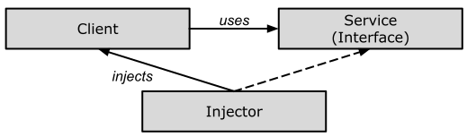

# Grundlagen

#### Dependency Injection

Im letzten Abschnitt sind wir auf *Abstraktion* eingegangen, um Klassen lose zu koppeln.
In diesem Abschnitt werden wir *Dependency Injection* und das Strategie-Entwurfsmuster zusammen implementieren,
um jegliche Abhängigkeit in der Erstellung eines abhängigen Objekts vollständig aus der Klasse zu entfernen.
Das Ziel ist es also, die betrachteten Klassen vollständig lose zu koppeln.

*Dependency Injection* (DI) ist ein Entwurfsmuster, das zur Implementierung von IoC verwendet wird.
Es ermöglicht die Erstellung abhängiger Objekte außerhalb einer Klasse und stellt den Zugang 
dieser Objekte einer Klasse auf unterschiedliche Weise zur Verfügung.
Mit *Dependency Injection* verschieben wir die Erstellung und Bindung der abhängigen Objekte
außerhalb der von ihnen abhängigen Klasse.

#### Die 4 Rollen bei *Dependency Injection*

Um sich mit der *Dependency Injection* Technik vertraut zu werden,
benötigt man eine Reihe von Klassen und/oder Schnittstellen,
die vier grundlegende Rollen erfüllen. Diese sind:

  * Ein *Service*, der eine Dienstleitung bereit stellt und dem *Client* zur Verfügung stellt.
  * Ein *Client*, der den *Service* in Anspruch nehmen möchte.
  * Eine Schnittstelle (*Interface*), die vom *Client* verwendet und vom *Service* implementiert wird.
  * Eine *Injector* Klasse, die eine *Service* Instanz erstellt und diese in den Client injiziert.



Abbildung 1: Beziehung zwischen den unterschiedlichen Klassen bei *Dependency Injection*.

Wie man Abbildung 1 entnehmen kann, erstellt die *Injector*-Klasse ein Objekt der *Service*-Klasse
und injiziert dieses Objekt in ein *Client*-Objekt.
Auf diese Weise trennt das *Dependency Injection*-Entwurfsmuster die Verantwortung
für das Erstellen eines Objekts der Serviceklasse aus der Clientklasse heraus.

#### Arten der *Dependency Injection*

Wie wir gesehen haben, injiziert die Injektorklasse den Dienst (Abhängigkeit) in den Client (abhängig).

Technisch betrachten kann dieses "*injizieren*" auf drei Arten erfolgen:
über einen Konstruktor, über eine Eigenschaft oder über eine Methode.

  * *Construktor-Injection*:<br/>Die Abhängigkeit(en) werden über den Konstruktor einer Klasse bereitgestellt.
  * *Setter-Injection*:<br/>Der Client stellt eine *setter*-Methode zur Verfügung,
     mit deren Hilfe der *Injektor* die Abhängigkeit injiziert.
  * *Interface-Injection*:<br/>Bei dieser Art der Injektion implementiert die Clientklasse eine Schnittstelle,
    die die Methode(n) zum Bereitstellen der Abhängigkeit enthalten,
    und der Injektor verwendet diese Schnittstelle, um die Abhängigkeit der Clientklasse bereitzustellen.

In den Verantwortungsbereich einer *Dependency Injection* fallen somit:

1. Das Erstellen neuer Objekte,
2. die Kenntnis, welche Klassen diese Objekte benötigen.
3. diesen Klassen den Zugang zu diesen neu erzeugten Objekten zu ermöglichen.

WEITER MIT DEM BEISPIEL AUS DEM LEZTEN ABSCHNITT ..


```cpp

```

---

[Zurück](../Readme.md)

---
